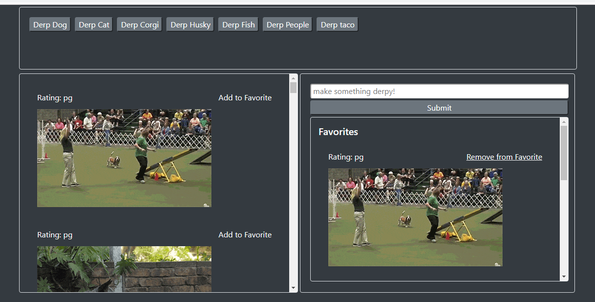

# Giphy Derpifier

## Summary
A site that utilizes AJAX to grab gifs from Giphy API. It prepends "derp" to every search item in hopes of getting derpy gifs.

### **Highlights:**
- Add/Remove Favorites
- Clicking on the gifs will toggle between animated/still
- Faux links with CSS/MouseOver/Click events


## Technologies Used
- HTML
- Bootstrap
- Javascript/jQuery
- CSS
- Git
- GitHub
- VSCode

## Goals
- Utilize some form of storage for data keeping

## Learning Experience
- Learned how to use AJAX
- Learned how to use Giphy's API!
- Gotten better at creating elements with jQuery

## Site Picture


## Code Snippet
I chose these lines of code because they highlight the most recent things I've learned

```
// show gifs
function showGifs(q) {
    // get gif info from giphy api
    var queryURL = "https://api.giphy.com/v1/gifs/search?q=" + q + "&api_key=dc6zaTOxFJmzC&limit=10";

    $.ajax({
        url: queryURL,
        method: "GET"
    }).then(function(response) {
        var results = response.data;
        console.log(results)

        // create for loop to iterate through results
        for (var i = 0; i < results.length; i++) {
            var card = $("<div>");
            var derp = $("<div>");
            var p = $("<p>").text("Rating: " + results[i].rating);
            var span = $("<span>").attr("id", "fav");
            span.html("Add to Favorite");
            span.addClass("float-right m-auto");
            span.attr("data-id", results[i].id);
            p.addClass("card-title text-light");
            p.append(span);
            var derpImg = $("");
            derpImg.attr("src", results[i].images.fixed_height_still.url);
            derpImg.attr("data-still", results[i].images.fixed_height_still.url);
            derpImg.attr("data-animate", results[i].images.fixed_height.url);
            derpImg.attr("data-state", "still");
            derpImg.addClass("gif");
            derp.addClass("card-body");
            card.addClass("card mb-1 border-0 bg-dark");
            card.attr("id", results[i].id);

            derp.append(p, derpImg);
            card.append(derp);
            $("#derpGifView").prepend(card);
        }
    })
}

// make mouseenter event on span
$(document).on("mouseenter", "span", function() { 
    $(this).css("cursor", "pointer");
    $(this).css("text-decoration", "underline");
})

// make mouseout event on span
$(document).on("mouseout", "span", function() { 
    // $(this).css("cursor", "cursor");
    $(this).css("text-decoration", "none");
})

// when add favorite is clicked
$(document).on("click", "#fav", function() {
    addFavorite($(this).attr("data-id"));
})

// when remove favorite is clicked
$(document).on("click", "#favd", function() {
    var dataid = $(this).attr("data-id");
    $("#f"+dataid).remove();
})
}
```

## Links
Live Page: https://seiretsym.github.io/giftastic<br>
Repo: https://github.com/seiretsym/giftastic<br>
LinkedIn: https://www.linkedin.com/in/kerwinhy/<br>
GitHub: https://github.com/seiretsym<br>